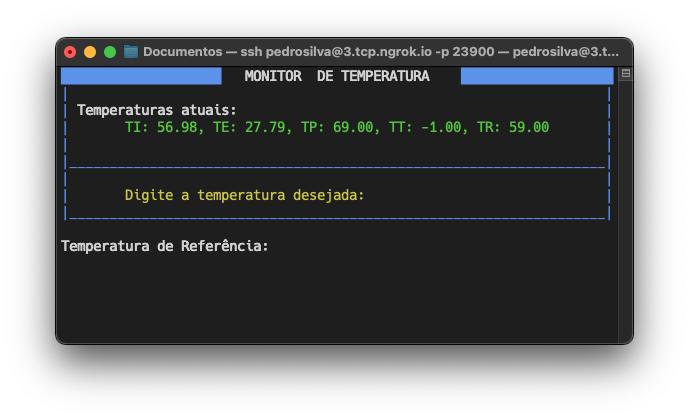
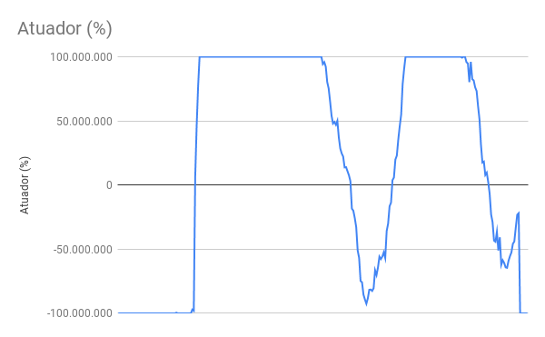

# PROJETO 1 - FUNDAMENTOS DE SISTEMAS EMBARCADOS

Projeto 1 da disciplina de Fundamentos de Sistemas Embarcados (2020/2)

## 1. Objetivos
Este trabalho tem por objetivo a implementação do controle de temperatura de um sistema que possui internamente dois dispositivos para alterar sua temperatura. O primeiro é um resistor de potência de 15 Watts utilziado para aumentar temperatura e o segundo, uma ventoinha que puxa o ar externo (à temperatura ambiente) para reduzir a temperatura.
A temperatura de referência (TR) deve poder ser definida pelo usuário do sistema de duas maneiras:

Através de um Potenciômetro;
Através de entrada de teclado no terminal.

O controle de temperatura do sistema deve ser realizado utilizando a abordagem de controle PID (Proporcional Integral Derivativo). O PID é um dos tipos mais simples de algoritmos de controle que proporciona um bom desempenho para uma grande variedade de aplicações.
Neste caso, quando o valor medido de temperatura ficar abaixo do limite inferior, o controlador deverá acionar o resistor de potência para aquecer o sistema. Caso a temperatura medida esteja acima do limite superior, o controlador deve desligar a resistência e acionar a ventoinha.

## 2. Como executar
Basta dar clone no [repositório pessoal de FSE](https://github.com/pedroeagle/fse) e abrir o diretótio **trabalho1**. Dentro do diretório do trabalho basta executar o comando `make` no terminal para compilar o programa e `make run` para iniciar o programa.

## 3. Entradas e Saídas 
O projeto roda em uma Raspberry Pi 4 conectada a um Arduino. Conectada às placas estão alguns componentes úteis para entrada e saída de informações.
- TI: Temperatura interna, lida pelo padrão de comunicação UART. Lido do sensor LM35 conectado ao Arduino.
- TE: Temperatura externa, lida pelo padrão de comunicação I2C. Lido do sensor BME280 conectado à Raspberry.
- TP: Temperatura do potenciômetro, lida pelo padrão de comunicação UART. Lido do potenciômetro conectado ao Arduino.
- TT: Temperatura do terminal, lida no terminal de execução do programa.

Ao escolher, como temperatura de referência, a temperatura do potenciômetro esta então é atualizada para a TP mais atual. Ao selecionar a temperatura do terminal como referência a do potenciômetro é então substituída.
A cada 2s é atualizado um arquivo csv no diretório `/log`. É criado um arquivo novo para cada execução, o nome do arquivo é a data e horário iniciais de execução do programa.
Obs: Para que a temperatura de referência se atualize com a temperatura do potenciômetro é necessário que o usuário selecione a primeira opção do programa. Isto é feito para evitar que durante um experimento a temperatura de referência se altere, afentando a observação dos dados.

## 4. Funcionalidades
O terminal atualizará na frequência de 1s o valor das temperaturas TI, TE, TP, TT, TR. 
 
Definindo a temperatura a partir do terminal: TT. 

## 5. Gráficos
### Gráfico temperaturas Ambiente, Interna e Referência (Potenciômetro)

### Gráfico acionadores (ventoinha, resistor)

