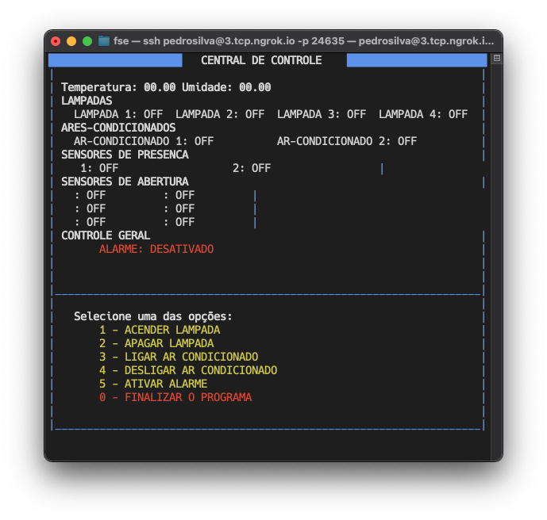

# PROJETO 2 - FUNDAMENTOS DE SISTEMAS EMBARCADOS

Projeto 2 da disciplina de Fundamentos de Sistemas Embarcados (2020/2)

## 1. Objetivos
Este trabalho tem por objetivo a criação de um sistema distribuído de automação residencial para monitoramento e acionamento de sensores e dispositivos. O sistema deve ser desenvolvido para funcionar em um conjunto de placas Raspberry Pi com um servidor central responsável pelo controle e interface com o usuário e servidores distribuídos para leitura e acionamento dos dispositivos. Dentre os dispositivos envolvidos estão o monitoramento de temperatura, sensores de presença, sensores de abertura e fechamento de portas e janelas, acionamento de lâmpadas, aparelhos de ar-condicionado e alarme.

A raspberry responsável pelo servidor central mostra em tempo real o estado de sensores, lâmpadas, ar-condicionados e alarmes. Além disso é mostrada a temperatura e umidade do ambiente. O usuário pode ligar e desligar qualquer lâmpada e ar-condicionado a qualquer momento além de ativar o alarme que quando ativado, toca um alarme ao perceber presença ou abertura de porta/janela.

Já a raspberry responsável pelo servidor distribuído consulta a cada um segundo os valores de umidade e temperatura além de ser sensível a mudanças nos sensores, lâmpadas e ar-condicionados de forma que mantenha o servidor central sempre atualizado.

É gerado um arquivo csv indicando cada uma das funcionalidades solicitadas pelo usuário assim como acionamento do alarme.

## 2. Como executar
Basta dar clone no [repositório pessoal de FSE](https://github.com/pedroeagle/fse) e abrir o diretótio **trabalho2**. Dentro do diretório do trabalho existem dois diretórios: **central** e **distribuido**. Basta executar o comando `make` no terminal para compilar o programa e `make run` para iniciar o programa no diretório adequado para a raspberry respectiva.

## 3. Entradas e Saídas 
- Ao selecionar a primeira opção o usuário pode selecionar qual lâmpada quer ligar.
- Ao selecionar a segunda opção o usuário pode selecionar qual lâmpada quer desligar (é solicitada uma lâmpada que esteja ligada).
- Ao selecionar a terceira opção o usuário pode selecionar qual ar-condicionado quer ligar.
- Ao selecionar a quarta opção o usuário pode selecionar qual ar-condicionado quer desligar (é solicitado um ar-condicionado que esteja ligado).
- Ao selecionar a quinta opção o usuário pode ativar ou desativar o alarme. Caso um sensor seja acionado enquanto alarme está ativado é tocado um som até que o sensor ou alarme sejam desativados.

A cada funcionalidade solicitada pelo usuário é atualizado um arquivo csv no diretório `/log`. É criado um arquivo novo para cada execução, o nome do arquivo é a data e horário iniciais de execução do programa.

## 4. Funcionalidades
Tela principal do programa nas raspberry do servidor central. 
 
Tela principal após o alarme ser acionado.  
  