# FSE - Trabalho Final

## Dados

| Aluno | Matrícula |
| --- | --- |
| Pedro Igor | 17/0062635 |
| Alexandre Miguel Rodrigues Nunes Pereira | 16/0000840 |

## Introdução

O Projeto em questao busca realizar a implementação de um sistema de controle, com um computador atuando como um **Sistema Central** e um conjunto de placas ESP-32 atuando como um **Controlador Distribuido**, cada, através de uma conexão  via Wifi por meio do protocolo MQTT, como descrito no repositório do projeto em [https://gitlab.com/fse_fga/projetos_2020_2/trabalho-final-2020-2](https://gitlab.com/fse_fga/projetos_2020_2/trabalho-final-2020-2).

## Dependências

* [Biblioteca ESP32-DHT11](https://github.com/0nism/esp32-DHT11)
* Node na versão 16 ou superior

## Link do Vídeo

O seguinte link contém um vídeo de exemplo de funcionamento da aplicação, configuração e uso do presente projeto:

* [Trabalho Final - FSE 2/2020](https://youtu.be/5r1ApviQ0eI)

## Execução

Para executar o programa basta clonar o repositório presente e seguir os processos indicados, especificamente, para o **Servidor Central** e os **Dispositivos**. Para a correta execução do fluxo, é necessário que o **Servidor Central** seja executado antes dos dispositivos, entretanto, a configuração dos dispositivos demanda mais etapas, então será abordada primeiramente a partir do próximo tópico.

## **Dispositivos - ESP 32**

Todos os dispositivos configurados enviarão suas requisições do MQQT broker para o seguinte `path`, utilizando a matrícula do aluno **Alexandre Miguel Rodrigues Nunes Pereira**:

```css
fse2020/160000840/dispositivos/<MAC_ADDRESS>
```

### **Execução**

``` bash
# Clone do repositório
$ git clone https://github.com/pedroeagle/fse

# Vá para o diretório do projeto do servidor central
$ cd fse/trabalho3/client

# 1 - Exporte os arquivos de configuração da ESP para essa pasta
$ . /home/user/esp-idf/export.sh

# 2 - Realize a configuração do menu
$ idf.py menuconfig

# 3 - Realize o build com a limpeza de dados
$ idf.py build fullclean 

# 4 - Limpa memória flash armazenada na ESP 
$ idf.py -p /dev/ttyUSB0 erase_flash 

# 5 - Realize a execução com o monitor
$ idf.py -p /dev/ttyUSB0 flash monitor 

```

### **1 - Exportar idf.py**

Executa comando para exportar arquivos de configuração em `python` para a pasta em que o projeto será executado, conforme um comando que segue o caminho em que os arquivos foram instalados: 

``` bash
# 1 - Exporte os arquivos de configuração da ESP para essa pasta
$ . /home/user/esp-idf/export.sh
```


### **2 - Configura Menu**

Executa comando para configurar as variáveis de menu, que definem como a aplicação será executada no contexto da ESP 32 

``` bash
# 2 - Realize a configuração do menu
$ idf.py menuconfig
```


#### **2.1 - Configura Tamanho de Flash**

Primeiro, deve-se selecionar a opção de ***Serial flasher config*** para aumentar a quantidade de espaço destinada à partiçào que será configurada:

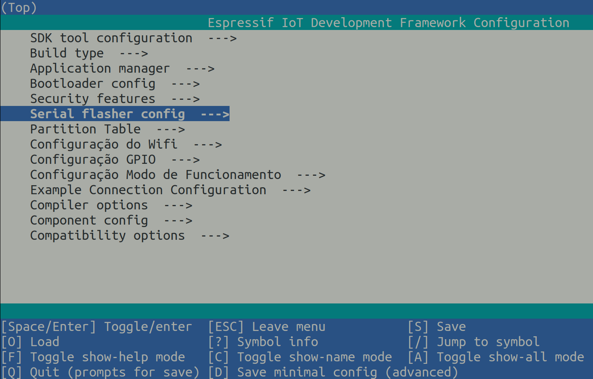

Deve-se modificar a variável `flash size` da quantidade de `2 MB` para `4 MB`:


Dessa forma, a opção `4 MB` deve ser selecionada para prosseguir com a configuração:

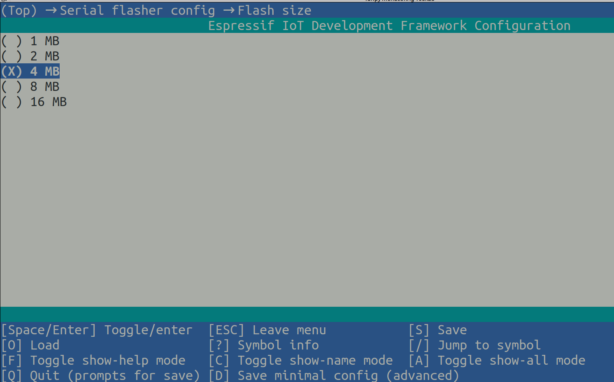

### **2.2 - Configura Partição**

Após expandir a quantidade de armazenamento, deve-se definir a tabela de partições, que estará conectada com o arquivo `partition.csv` que se encontra na pasta `client` desse projeto:

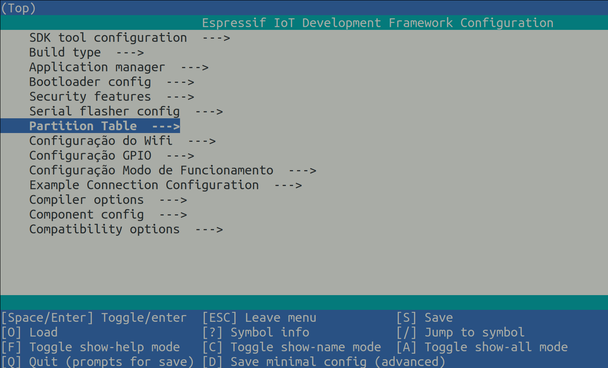

Deve-se selecionar a opção de definir uma partição customizada a partir de uma tabela CSV, conforme a imagem abaixo:

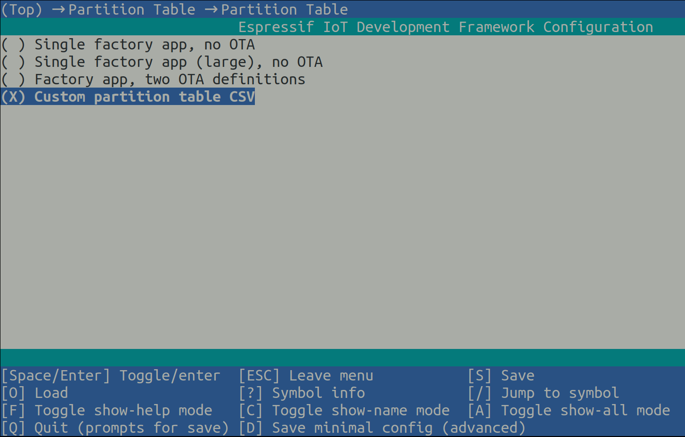

É preciso se manter atento para renomear o arquivo de referência, que deve ser `partition.csv`, sem o 's' que a versão *default* contém, finalizando como indicado abaixo:


### **2.3 - Configura Wi-Fi**

Em seguida, deve-se acessar as configurações de Wi-Fi, como o ssid da rede (nome da rede visíviel aos usuários) e a senha de acesso à rede Wi-Fi. Deve-se atentar para somente conectar a ESP a redes 2G, pois não há suporte para conexão em redes 5G.

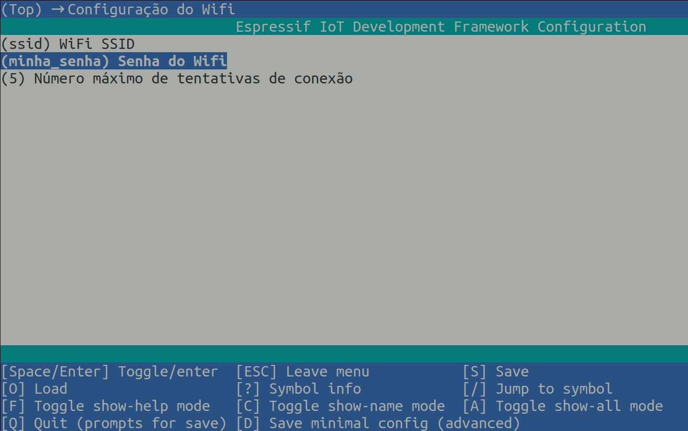

### **2.4 - Configura GPIO**

Deve-se, então, configurar as portas que serão utilizadas pela GPIO da ESP em questão, uma vez que pode ocorrer a necessidade de modificação dessas portas de referência de acordo com o modelo da ESP utilizada. A Versão padrão corresponde aos dados abaixo na imagem, que representam a ESP padrão *devkit v1*.

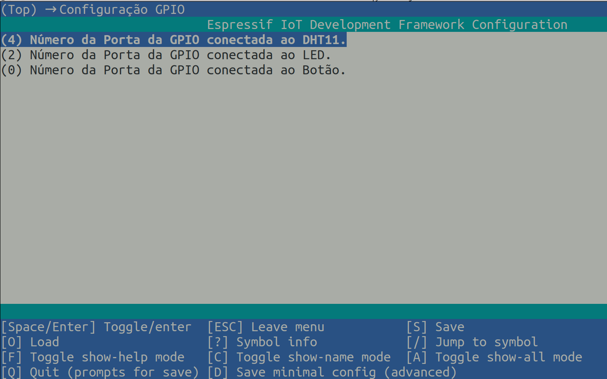

### **2.5 - Configura Modo de Funcionamento**

Por fim, uma etapa crucial é definir como a ESP em questão funcionará dentro do contexto no qual será implementada, sendo possível ao usuário escolher entre o **Modo Energia** em que a ESP fornece dados periódicos de Temperatura e Umidade, além de obter suporte a mecanismos de **Entrada** e **Saída** de dados, ao contrário do **Modo Bateria (Low Power)** que funciona no modo **Deep Sleep** e apenas envia dados a partir da **Entrada**, representada pelo botão.

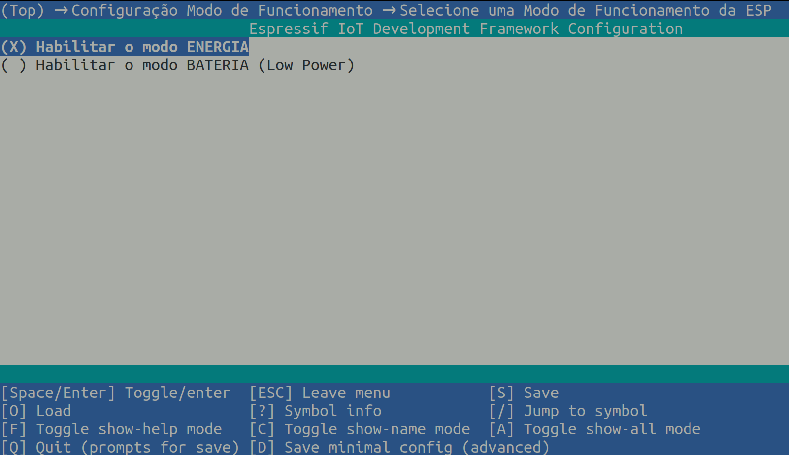

### **3 - Realiza Build**

Executa comando de build, utilizando o parâmetro `fullclean` para compilar os dados do zero, permitindo uma integração completa e atualização de acordo com as modificações realizadas no Menu

``` bash
# 3 - Realize o build com a limpeza de dados
$ idf.py build fullclean
```

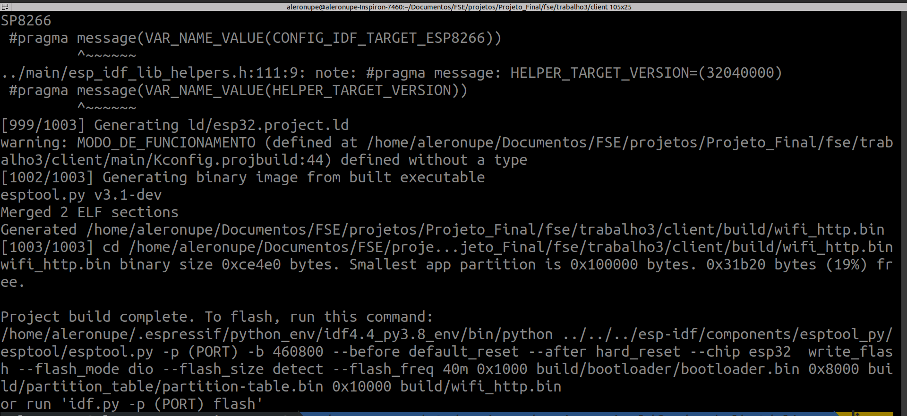

### **4 - Realiza Limpeza de Flash**

É **EXTRAMENTE IMPORTANTE** realizar a limpeza da memória flash das ESPs utilizadas no projeto caso elas não tenham sido reiniciadas ou removidas, pois as variáveis para reconexão são armazenadas nessa memória, portanto esse comando é necessário sempre que novas modificações forem feitas e se desejar que a ESP funcione como um novo dispositivo, caso não tenha sido reiniciada ou removida.

``` bash
# 4 - Limpa memória flash armazenada na ESP 
$ idf.py -p /dev/ttyUSB0 erase_flash 

```
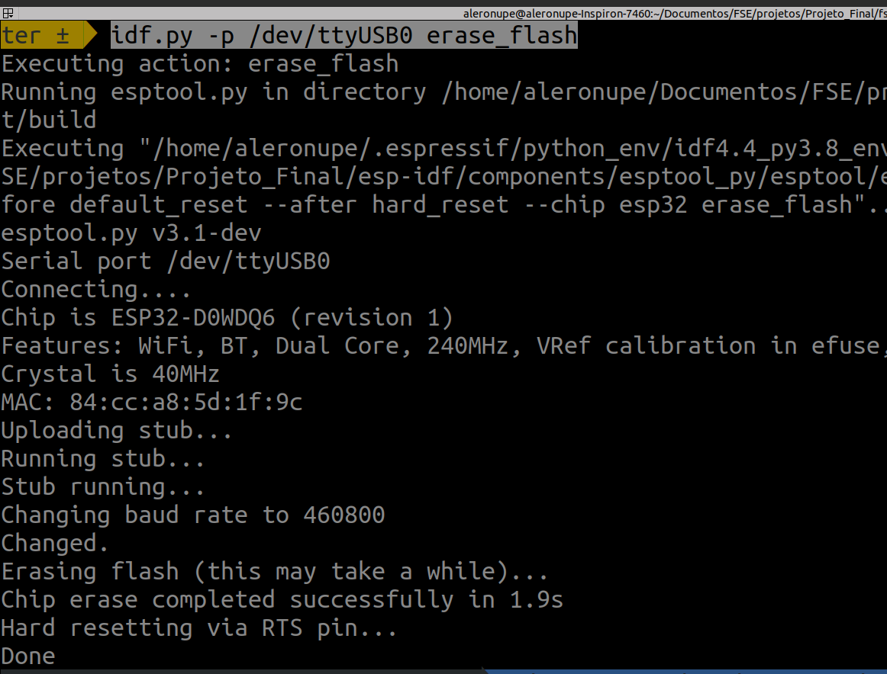


### **5 - Realiza Execução**

Por fim, basta executar o comando para iniciar a aplicação do cliente a partir da ESP, utilizando as flags para verificar, através do monitor, como estão sendo processadas as execuções no dispositivo.

``` bash
# 5 - Realize a execução com o monitor
$ idf.py -p /dev/ttyUSB0 flash monitor 

```


Assim, será possível acompanhar diferentes status e feedbacks do dispositivo em logs que aparecerão na tela:

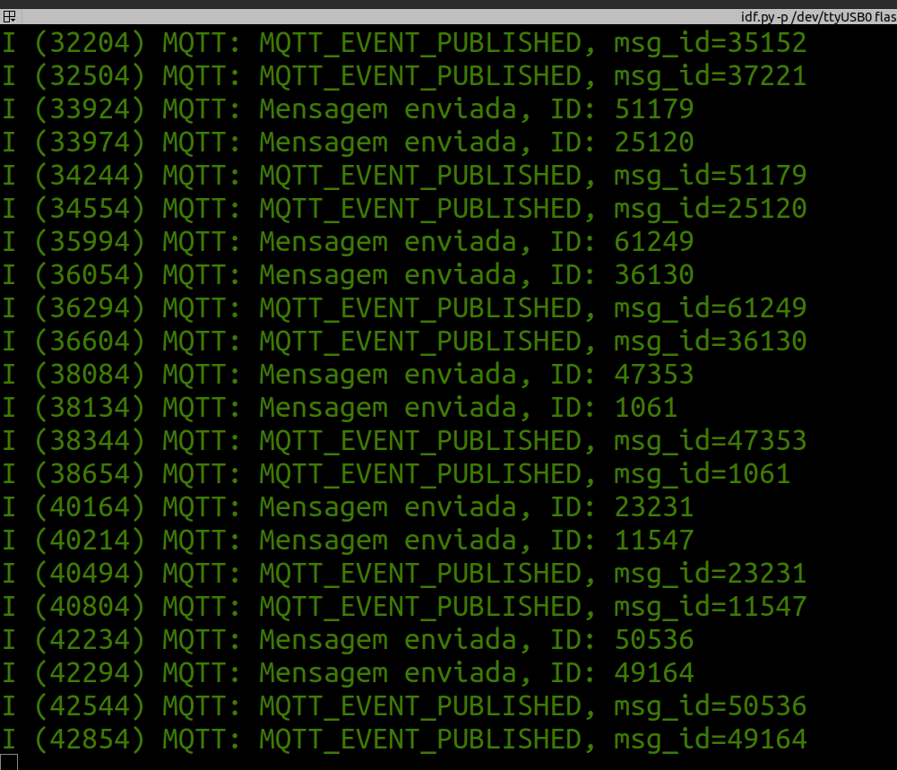

### **6 - Reset da placa**
Ao pressionar e segurar o botão de entrada da placa por cerca de 5 segundos a placa é então se desconecta do servidor central, reinicia sua utilização e fica disponível novamente como um dispositivo novo. Para ter certeza de que o modo foi acionado basta esperar que o led de saída pisque por 3 ou 4 vezes antes de reiniciar o dispositivo. Como no trabalho não foi definido protocolo de desconexão, do servidor central, a partir da esp isso é feito manualmente removendo o dispositivo da central e o aceitando novamente.

## **Servidor Central**

### **Execução**

``` bash
# Clone do repositório
$ git clone https://github.com/pedroeagle/fse

# Vá para o diretório do projeto do servidor central
$ cd fse/trabalho3/central

# Instalar dependências do projeto.
$ npm install --force #ou yarn install
```
Resultado esperado após a instalação: <br/>


É necessário criar um arquivo ```.env``` com a variável MATRICULA com o numero de matrícula que será utilizado no path de comunicação.
Conteúdo do .env que deve ser colocado no diretório 'central/':
```
MATRICULA=17123456
```

``` bash
# Iniciar a aplicação
$ npm run start #ou yarn run start
```
Resultado esperado após o início da aplicação: <br/>
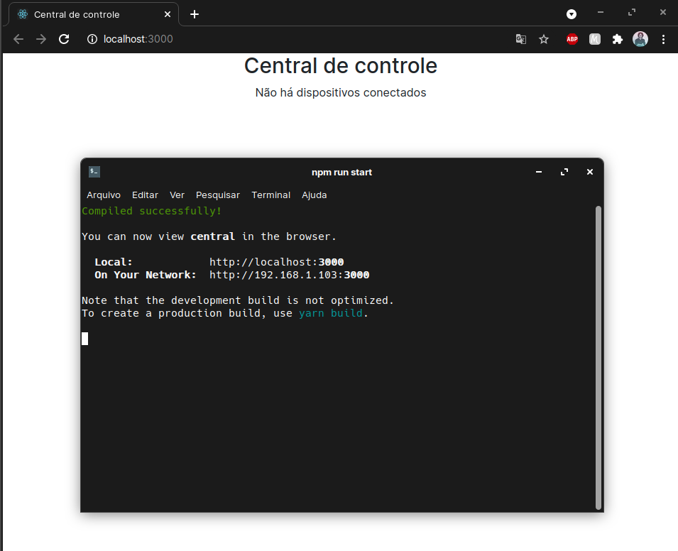

Será criado um server local e informado a porta em que estará executando. Acessando o host informado é possível acessar a página inicial da central de controle sem dispositivos conectados ainda.

### **Painel de controle**
Ao iniciar a esp32 será enviada uma mensagem de inscrição para o seguinte Broker: ```mqtt://broker.emqx.io:1883``` no canal ```fse2020/160000840/dispositivos/${mac_address_da_esp32}```. O servidor central mostrará uma notificação informando que um novo dispositivo foi encontrado além de informações como o modo de funcionamento e o mac address do dispositivo. <br/>
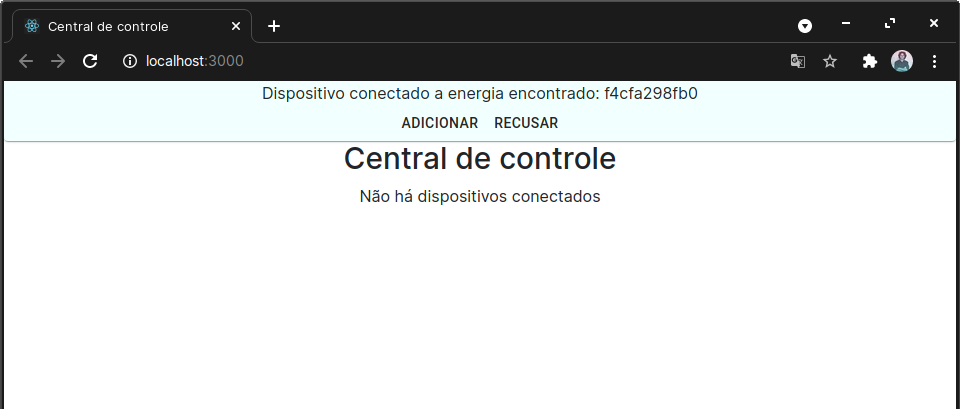 <br/>

Após aceitar o dispositivo é aberto um modal para a configuração do cômodo além do nomes dos dispositivos de entrada e saída.<br/>
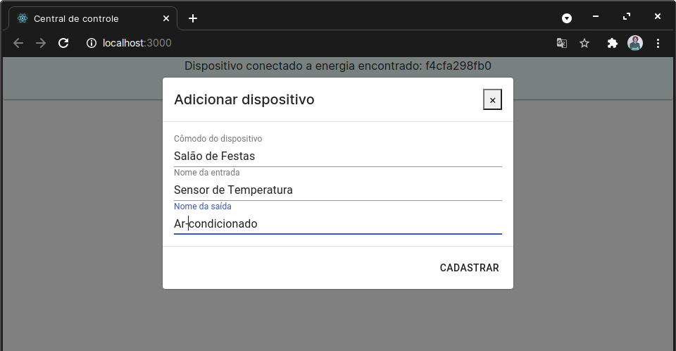<br/>

Após configurar o dispositivo é aberto um painel com todos os dispositivos conectados além de funcionalidades como "Ativar e desativar alarme", "Ativar e desativar áudio do alarme", "Download dos logs".<br/>
<br/>

É possível visualizar todas as informações do dispositivo tais como o nome do cômodo, o modo, dispositivo de entrada, mac address, horário da última utilização, para dispositivos em modo energia: o dispositivo de saída, umidade, temperatura, um botão para ligar/desligar o dispositivo de saída.<br/>
<br/>

Caso um dispositivo em modo energia fique 30 segundos sem atualizar seus estados é então mostrada uma notificação de inatividade. <br/>
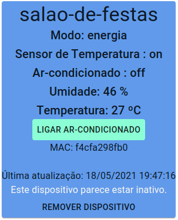<br/>

Caso o alarme esteja ativado, se um dispositivo de entrada de uma esp32 em qualquer modo for acionado é então disparado um alarme que só pode ser desacionado pelo usuário na central de controle. O alarme deixa a tela vermelha além de tocar um som que pode ser mutado.
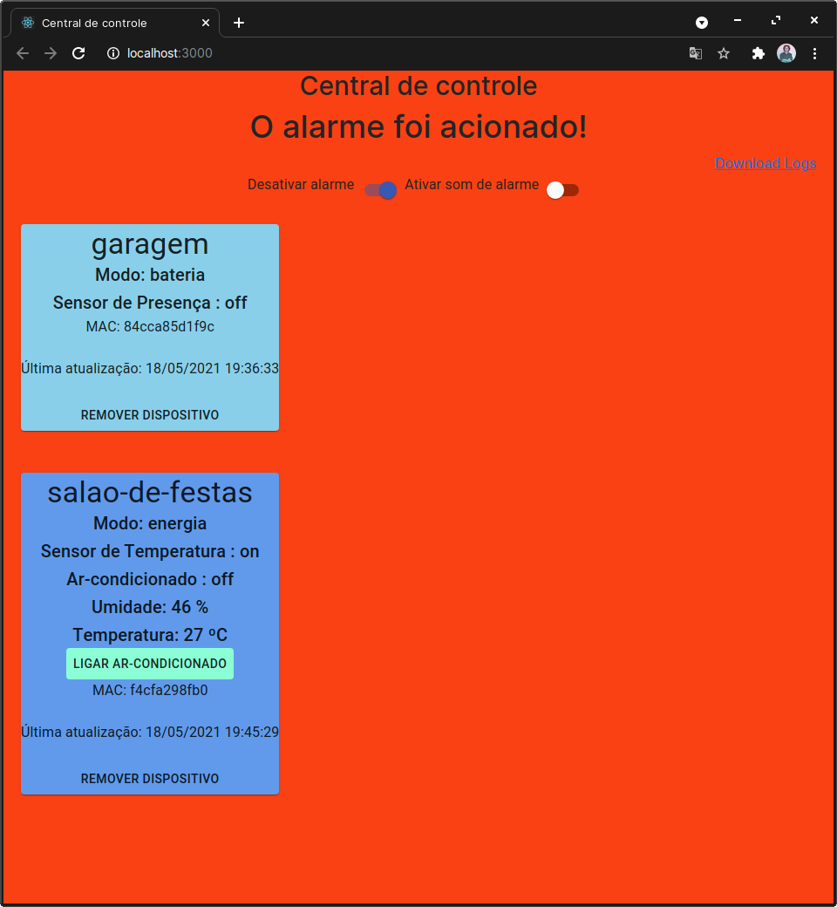<br/>

É possível ainda realizar o download dos logs de acionamento do alarme e dispositivos de saída por meio do link no canto superior direito da página.

<br/>